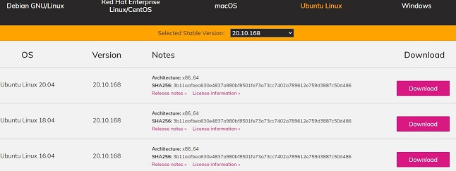
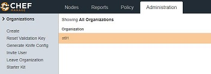
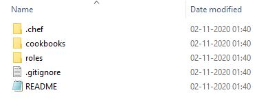

## Chef Lab:

#### **This part of Lab describes how to setup the Chef workstation and start creating workbooks and recipes**

##### Workstation:
### Create workstation
####  download  chef-workstation
From the **chef downloads** site https://downloads.chef.io/products/workstation  <br>
 <br>
select the OS and download the required version <br>
once download started, browser tab pause download and right click on the url, copy the link and run below command <br>
```js
#wget https://packages.chef.io/files/stable/chef-workstation/20.10.168/ubuntu/20.04/chef-workstation_20.10.168-1_amd64.deb
```
This will download the package to the workstation node
##### for ubuntu run below command to install chef, 
```js
#dpkg -i chef-workstation_20.10.168-1_amd64.deb
```
###### Once the chef is installed, verify the version with below command, to ensure it is installed
```js
#chef --version
```
**Create cookbooks directory later we create  all the cookbook**
#### #mkdir cookbooks

#### under cookbooks directory create cookbooks
## chef generate cookbook <cookbook-name>
#### #chef generate cookbook new-cookbook
After creating the chef cookbook, in the cookbook directory,  default files are created like, <br>
1. chefignore   --> ignore while update<br>
2. kitchen.yml for testing the cookbook <br>
3. metadata.rb     --> name,version,author of the cookbook <br>
4. readme          --> information about the cookbook, user group etc <br>
5. recipe         --> is the code file <br>
6. spec            --> for unit testing <br>
7. test            --> for integration test  <br>

### create recipe
#### chef generate recipe <recipe-name> <br>
### #chef generate recipe new-recipe <br>
which creates recipe file in default recipes directory <br>
##### Add the content into the recipe file  as show below <br>

### new-recipie.rb file is like below, which consists of code: <br>
file '/newfile' do             --> File name to be created and "do" means create <br>
content 'Chef new file'        --> Content in the file, after creation of the file, chef will place the content <br>
action :create                 --> Create the file <br>
end                            --> end of the task <br>

### To ensure no syntax error of the file 
```
#### #chef exec ruby -c new-cookbook/recipes/new-recipie.rb 

```
#### Run the chef-client to execute the recipe

```json
 #chef-client -zr "recipe[new-cookbook::new-recipe]"
```
#### On successful run it produces the output as 


Starting Chef Infra Client, version 16.6.14
Patents: https://www.chef.io/patents
resolving cookbooks for run list: ["new-cookbook::new-recipe01"]
Synchronizing Cookbooks:
  - new-cookbook (0.1.0)
Installing Cookbook Gems:
Compiling Cookbooks...
Converging 1 resources
Recipe: new-cookbook::new-recipe01
  * file[/newfile] action create
    - create new file /newfile
    - update content in file /newfile from none to d3b7c9
    --- /newfile   2020-10-28 19:45:59.780289866 +0000
    +++ /.chef-falafal20201028-8246-ckf0aa 2020-10-28 19:45:59.780289866 +0000
    @@ -1 +1,2 @@
    +Chef new file
Running handlers:
Running handlers complete
Chef Infra Client finished, 1/1 resources updated in 01 seconds

#### Creating multiple recipes
####	Using knife transfer the code to server

### to execute this file, run as below
```rb
### chef-client -zr "recipe[new-cookbook::new-recipe02]"  --> this creates a new file as "newfile"
```


```ruby
package 'tree' do   # --> package installation
action :install    # --> specifying the action
end 
```
```rb
file 'testfile' do   # --> specify the file
content 'Chef test file' #--> content of the file
action :create            # --> action on the files
owner 'root'              # --> owner and group of the file 
group 'root'
end
```
```rb
package 'apache2' do   # --> install httpd package 
action :install 
end 


file '/var/www/html/index.html' do  # --> content in index.html 
content 'First delicious recipe' 
action :create   # --> create the file 
end 


service 'apache2' do            # --> start the httpd service
action [:enable, :start] 
end  
```

<ins>**Create Cher Server and attaching nodes** </ins> <br>

create account in manage.chef.io webseite which acts as chef server for workstation and nodes 
https://manage.chef.io/login <br>

create organization and add nodes, organization  discriminates types of nodes (like web, db etc) <br>
give name and shortname for the organization, this gives to a page where all the configurations are visible <br>
 <br>
Click on Administration, which displays all the organizations created <br>
Click on starter kit (left side)--> shows the download "starter kit" --> clicking on it  downloads starterkit  <br>
 <br>
It downloads into the local machine, which is a .rar file, click on the "chef-starter" to extract the files, and it consists of "chef-repo folder" <br>
click on chef-repo folder and it consists of <br>
folders, .chef, cookbooks,roles and files .gitignore and Readme. <br>
copy the folder chef-repo from local extracted folder  to chef workstation machine <br>
if local machine is windows use "winscp" <br>
 <br>
if local machine is linux use "scp"  <br>
 On chef workstation run below commands <br>
 
 ```
 # cd chef-repo
 ```
 #### to list all files including hidden files
 ```
 # ls -al 
 ```
 #### change directory to .chef
 ```js
 # cd .chef 
 ```
 which displays .config.rb  and the pem file( which is a private key)
 .config.rb consists of the url of chef server
 run the below command to verify the workstation connectivity to the server
 ```rb
# knife ssl check
```
 if the connection is successful, displays below message
 Connecting to host api.chef.io:443
Successfully verified certificates from `api.chef.io' 

Upon connecting the workstation to chef server, next step is to connect the nodes, to the server <br>
the process of connecting the node to server is called BOOTSTRAPPING <br>
the process bootstrapping ensures the server connectivity to the node by installing "chef client" and "ohai" <br>
chef-client is process ensures the node connectivity to the chef server to get updates <br>
ohai is the internal DB, which tells the chef-client about the status of the installations <br>

The essentials of creating the nodes <br>
If the nodes are in cloud, make sure the ssh is working, the node private key file(.pem file) is copied to workstation to enable secure connection (ssh/scp)<br>
The required ports are opened properly(port 22 for ssh and other application ports like port 80 for web etc.) <br>

To enable server to ssh to the node, make sure the private key of the node copied to workstation(though workstation don't directly to the node, copying the key 
into workstation enables ssh to the node <br>

**copy the nodes private key to workstation "chef-repo" directory** 
To create the chef-client on the node, run the below command  <br>

```rb
# knife bootstrap <node-ip> --ssh-user <user-name>  --sudo -i <privatekey.pem> -N node <node-name>
```

Example: <br>
```rb
# knife bootstrap x5.2xx.2x.x7 --ssh-user root --sudo -i priv.pem -N node node01
```

Once the command is run, if all the components in the command are correct, the output will be as below

```js
Are you sure you want to continue connecting  --> asks for confirmation
? (Y/N) Y   								  --> type Y
Connecting to xx.xx.xx.xx using ssh           --> connects to the node and installs chef client
Creating new client for node
Creating new node for node
Bootstrapping xx.xx.xx.xx
 [xx.xx.xx.xx] -----> Installing Chef Omnibus (stable/16)
downloading https://omnitruck.chef.io/chef/install.sh
  to file /tmp/install.sh.2426/install.sh
 [xx.xx.xx.xx] trying wget...
 [xx.xx.xx.xx] ubuntu 18.04 x86_64
 [xx.xx.xx.xx] Getting information for chef stable 16 for ubuntu...
 [xx.xx.xx.xx] downloading https://omnitruck.chef.io/stable/chef/metadata?v=16&p=ubuntu&pv=18.04&m=x86_64
  to file /tmp/install.sh.2430/metadata.txt
 [xx.xx.xx.xx] trying wget...
 [xx.xx.xx.xx] sha1    45ca38c5c110217fd36ffa7126c76e23c80fb001
sha256  3d260619c94108a0f5f25652fdea478e1f361e7ad40852420b94938bfe2e3184
url     https://packages.chef.io/files/stable/chef/16.6.14/ubuntu/18.04/chef_16.6.14-1_amd64.deb
version 16.6.14
 [xx.xx.xx.xx]
 [xx.xx.xx.xx] downloaded metadata file looks valid...
 [xx.xx.xx.xx] downloading https://packages.chef.io/files/stable/chef/16.6.14/ubuntu/18.04/chef_16.6.14-1_amd64.deb
  to file /tmp/install.sh.2430/chef_16.6.14-1_amd64.deb
 [xx.xx.xx.xx] trying wget...
 [xx.xx.xx.xx] Comparing checksum with sha256sum...
 [xx.xx.xx.xx] Installing chef 16
installing with dpkg...
 [xx.xx.xx.xx] Selecting previously unselected package chef.
 [xx.xx.xx.xx] (Reading database ... 50310 files and directories currently installed.)
 [xx.xx.xx.xx] Preparing to unpack .../chef_16.6.14-1_amd64.deb ...
 [xx.xx.xx.xx] Unpacking chef (16.6.14-1) ...
 [xx.xx.xx.xx] Setting up chef (16.6.14-1) ...
 [xx.xx.xx.xx] Thank you for installing Chef Infra Client! For help getting started visit https://learn.chef.io
 [xx.xx.xx.xx] Starting the first Chef Infra Client Client run...
 [xx.xx.xx.xx] +---------------------------------------------+
✔ 2 product licenses accepted.
+---------------------------------------------+
 [xx.xx.xx.xx] Starting Chef Infra Client, version 16.6.14
Patents: https://www.chef.io/patents
 [xx.xx.xx.xx] [2020-11-02T10:17:52+00:00] ERROR: shard_seed: Failed to get dmi property serial_number: is dmidecode installed?
 [xx.xx.xx.xx] resolving cookbooks for run list: []
 [xx.xx.xx.xx] Synchronizing Cookbooks:
 [xx.xx.xx.xx] Installing Cookbook Gems:
 [xx.xx.xx.xx] Compiling Cookbooks...
 [xx.xx.xx.xx] [2020-11-02T10:17:52+00:00] WARN: Node node has an empty run list.
 [xx.xx.xx.xx] Converging 0 resources
 [xx.xx.xx.xx]
Running handlers:
 [xx.xx.xx.xx] Running handlers complete
 [xx.xx.xx.xx] Chef Infra Client finished, 0/0 resources updated in 02 seconds
 ```
 Once the chef-client is successfully installed on the node, run the below command on chef-workstation <br>
 
 ```rb
 # knife node list
 ```
 The lists the nodes which has the chef client installed <br>
 
Initially during the setup of workstation the directory cookbooks is created and ran the various recipes like create file, install package and created webserver
This ensures the proper running of the packages and installations <br> 

after the downloading,  extracting the chef-repo  from server, the chef-repo will also consists of cookbooks <br>

the cookbooks in the chef-repo, all the next steps will happen from chef-repo cookbooks <br>

move the existing cookbooks from  ~cookbooks folder to ~chef-repo/cookbooks <br>
```rb
# mv ~cookbooks ~chef-repo/cookbooks
# rm -rf ~cookbooks
```
Just make sure delete only the old cookbooks <br>

Once the cookbooks are moved to the chef-repo directory, chef server need to be updated with the existing cookbooks, from next updates in the recipes in workstation
will update the server and server updates the clients(nodes) <br>

upload the cookbook with following command <br>

```
# knife cookbook upload <cookbookname>
```
Example: <br>
```
# knife cookbook  upload new-cookbook01
```
uploads the cookbook new-cookbook01 to server <br>
On server website, click on policy the uploaded cookbook is visible <br>
next step is run the uploaded recipe of the cookbook on node, with below command <br>

```
# knife node run_list set <chef-node> "recipe[cookbook-name::recipe-name]"
```
example:

```
# knife node run_list set chef-node01 "recipe[new-cookbook01::new-recipe]"
```

To verify the recipe in runlist, run the below command <br>

```
# knife node show <node-name>
```
Example:

```
# knife node show chef-node01
```

The output of the command will be like below <br>
```rb
# chef-node01:
  run_list: recipe[new-cookbook01::new-recipe]
root@chef-wrokstation01:~/chef-repo/cookbooks/new-cookbook01/recipes# knife node show chef-node01
Node Name:   chef-node01
Environment: _default
FQDN:        chef-node01.us-central1-a.c.august-broker-272610.internal
IP:          35.208.24.97
Run List:    recipe[new-cookbook01::new-recipe]
Roles:
Recipes:
Platform:    ubuntu 18.04
Tags:
```

on server web page, select the node and click on edit-runlist, which displays the runlists <br>

Next time when the recipe is updated, run the below command on chef-workstation <br>

```rb
 #knife cookbook upload <cookbook-name>
 ```
 This uploads the recipe to server, then run the below command again on the client to update recipe on client <br>
 
 ```rb
  # chef-client
 ```
 #### Once the chef-client is run, the output will be as below
 ```rb
 # chef-client
Starting Chef Infra Client, version 16.6.14
Patents: https://www.chef.io/patents
[2020-11-02T13:02:14+00:00] ERROR: shard_seed: Failed to get dmi property serial_number: is dmidecode installed?
resolving cookbooks for run list: ["new-cookbook01::new-recipe"]
Synchronizing Cookbooks:
  - new-cookbook01 (0.1.0)
Installing Cookbook Gems:
Compiling Cookbooks...
Converging 1 resources
Recipe: new-cookbook01::new-recipe
  * file[/newfile] action create
    - create new file /newfile
    - update content in file /newfile from none to b1db38
    --- /newfile        2020-11-02 13:02:15.732149257 +0000
    +++ /.chef-newfile20201102-5329-iahaqg      2020-11-02 13:02:15.728148985 +0000
    @@ -1 +1,2 @@
    +Welcome to chef delecies

Running handlers:
Running handlers complete
Chef Infra Client finished, 1/1 resources updated in 02 seconds
```
##### If the file is up to date, the output will be
```rb
Recipe: new-cookbook01::new-recipe
  * file[/newfile] action create (up to date)
```
 
 Till now the manual process of the upload of recipes to chef-clients is discussed <br>


Automate the process, so that the recipe updates will update the client automatically <br>

update the cron tab to run the command chef-client at specified time (minutes,hours,days etc.)<br>

in the crontab file add the details as below <br>
```
* * * * *  <user>  chef-client
```
Example:<br>

```rb
* * * * *  root  chef-client
```

This will run the chef every specified time and update the node. However it is not a good idea to automate the workstation <br>


