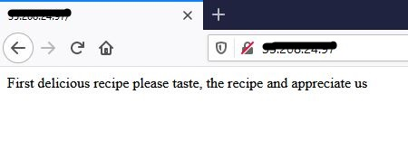
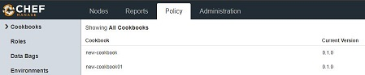
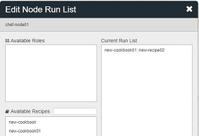
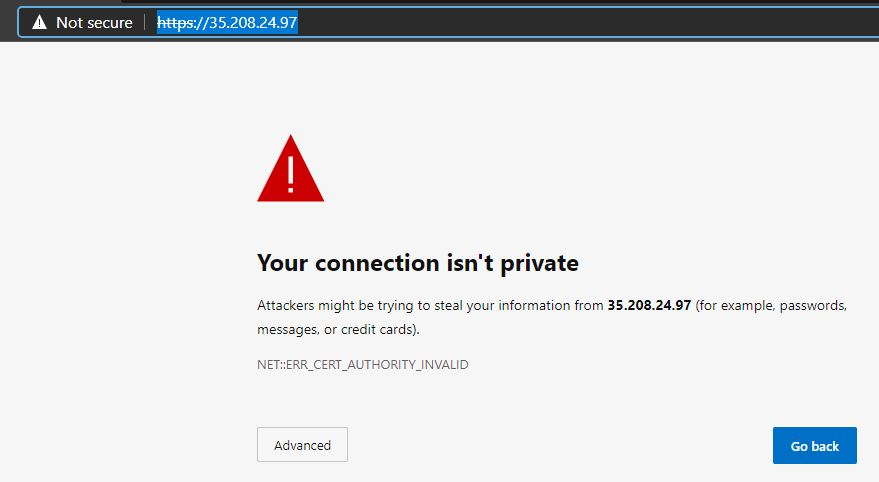
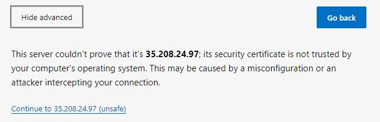
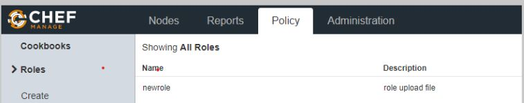
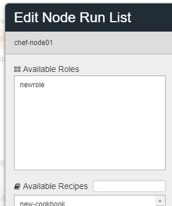

# Chef Lab:

## Agenda:
Chef is a configuration management tool to manage small and large scale infrastructure. The Lab exercise show the [requirements](https://docs.chef.io/chef_system_requirements), setup and working with Chef configuration 

To manage the infrastructure, Chef requires two Linux-based machines one for Chef-server and the other for Chef-Workstation. Small organizations can use the [Chef managed Server](https://manage.chef.io/) instead of setting up and managing Chef Server. 

The Lab setup discussed below, 
* Installation of Chef-Workstation and Chef-Client 
* Installation of Chef-Server and using [Chef managed Server](https://manage.chef.io/) 

#### **This part of Lab describes how to set up the Chef workstation and start creating workbooks and recipes**

### Step 1
### Installing workstation

Chef workstation is a Linux node in which all the configurations are created and tested, all successful configurations are pushed to Chef-Server.

####  Download  chef-workstation


Download the Chef-workstation package using the direct link below

```rb
#wget https://packages.chef.io/files/stable/chef-workstation/20.10.168/ubuntu/20.04/chef-workstation_20.10.168-1_amd64.deb
```

Alternatively, download link can be obtained from the download section of chef website  [here](https://downloads.chef.io/products/workstation)

 

Select the target OS and download the required version. However, the entire Lab discussed here is based on **Ubuntu-OS**. 


#### Install Chef workstation

```rb
# dpkg -i chef-workstation_20.10.168-1_amd64.deb
```

Once the chef is installed, verify the version with the below command, to ensure it is installed

```rb
#chef --version
```

### Step 2

##### Create Cookbooks and Recipes

Create cookbooks directory later we create  other cookbooks

```rb
# mkdir cookbooks
# cd cookbooks
```
In the cookbooks directory, generate cookbooks
	
 ```rb
# chef generate cookbook new-cookbook
 ```

After creating the chef cookbook, in the cookbook directory,  default files are created like

```rb
root@chef-wrokstation01:~/chef-repo/cookbooks01# tree
.
└── new-cookbook
    ├── CHANGELOG.md
    ├── LICENSE
    ├── Policyfile.rb
    ├── README.md
    ├── chefignore
    ├── kitchen.yml
    ├── metadata.rb
    ├── recipes
    │   └── default.rb
    ├── spec
    │   ├── spec_helper.rb
    │   └── unit
    │       └── recipes
    │           └── default_spec.rb
    └── test
        └── integration
            └── default
                └── default_test.rb

8 directories, 11 files
root@chef-wrokstation01:~/chef-repo/cookbooks01#
```

**Create recipe**  
TO create a recipe, change the directory to the required cookbook, and run the below command
```rb
# cd new-cookbook
```
chef generate recipe <recipe-name>  
	Example:
 ```rb
# chef generate recipe new-recipe
 ```
Which creates recipe file in default recipes directory  
Add the content into the recipe file  as show below  
The new recipe file will like this
```rb
file '/newfile' do            
content 'Chef new file'       
action :create                
end                           
```

new-recipie.rb file is like below, which consists of code and the details of the code is:  
```rb
file '/newfile' do            # --> File name to be created and "do" means create <br>
content 'Chef new file'       # --> Content in the file, after creation of the file, chef will place the content <br>
action :create                # --> Create the file <br>
end                           # --> end of the task <br>
```

#### To ensure no syntax error of the file, also whenever the changes made to recipe file this command will ensure the syntax errors
```
# chef exec ruby -c new-cookbook/recipes/new-recipie.rb 
```
*If no errors found in the code, the first time this will be executed locally on the workstation machine with the below command*
#### Run the chef-client to execute the recipe

```rb
# chef-client -zr "recipe[new-cookbook::new-recipe]"
```
On the successful run it produces the output as 

```rb
Starting Chef Infra Client, version 16.6.14
Patents: https://www.chef.io/patents
resolving cookbooks for run list: ["new-cookbook::new-recipe01"]
Synchronizing Cookbooks:
  - new-cookbook (0.1.0)
Installing Cookbook Gems:
Compiling Cookbooks...
Converging 1 resources
Recipe: new-cookbook::new-recipe01
  * file[/newfile] action create
    - create new file /newfile
    - update content in file /newfile from none to d3b7c9
    --- /newfile   2020-10-28 19:45:59.780289866 +0000
    +++ /.chef-falafal20201028-8246-ckf0aa 2020-10-28 19:45:59.780289866 +0000
    @@ -1 +1,2 @@
    +Chef new file
Running handlers:
Running handlers complete
Chef Infra Client finished, 1/1 resources updated in 01 seconds
```
Verify the new file is created on the localhost
```rb
root@chef-wrokstation01:~# ls /newfile
/newfile
root@chef-wrokstation01:~# cat /newfile
Chef new fileroot@chef-wrokstation01:~#
```
#### Creating multiple recipes  

To install multiple packages at the same time, the below example will perform 3 tasks at a time  
On running this task it creates a file name "testfile" and install packages "tree" and "apache"  
The recipe file for installing the above multiple packages is  
```rb
file 'testfile' do        
content 'Chef test file'  
action :create            
owner 'root'               
group 'root'
end

package 'tree' do   
action :install     
end 
 
package 'apache2' do    
action :install 
end 

file '/var/www/html/index.html' do  
content 'First delicious recipe please taste, the recipe and appreciate us' 
action :create   
end 
service 'apache2' do            
action [:enable, :start] 
end  
```
Details of the code for running multiple tasks is  

a. Creating 'testfile  

```rb
file 'testfile' do        # --> specify the file
content 'Chef test file'  # --> content of the file
action :create            # --> action on the files
owner 'root'              # --> owner and group of the file 
group 'root'
end
```
b. Intalling 'tree' package
```rb
package 'tree' do   # --> package installation
action :install     # --> specifying the action
end 
```
c. Installing 'apache' package 
```rb
package 'apache2' do   # --> install httpd package 
action :install 
end 


file '/var/www/html/index.html' do  # --> content in index.html 
content 'First delicious recipe please taste, the recipe and appreciate us' 
action :create   # --> create the file 
end 


service 'apache2' do            # --> start the httpd service
action [:enable, :start] 
end  
```

Once the file is created, execute with syntax check command, on successfully verifying no syntax errors run the client locally
```
# chef exec ruby -c new-cookbook/recipes/new-recipie.rb 
# chef-client -zr "recipe[new-cookbook::new-recipe]" 
```
Once the recipe is executed, a. file name testfile is created, b. packages tree and apache are installed  
Output of testfile
```rb
root@chef-wrokstation01:~# cat /testfile
Chef test fileroot@chef-wrokstation01:~#
```
Package "tree"
```rb
root@chef-wrokstation01:~# which tree
/usr/bin/tree
```
Package "apache"
```rb
root@chef-wrokstation01:~# curl localhost
First delicious recipe please taste, the recipe and appreciate usroot@chef-wrokstation01:~#
```
Also open browser and run the IP address of the node   

  


### Step 3  

<ins>**Create Cher Server and attaching nodes** </ins>  

create an account in [manage.chef.io](https://manage.chef.io/login) website which acts as chef-server for workstation and nodes  
 

create organization and add nodes, organization  segregate the types of nodes (like web, db etc)  
Give "name" and short "name" for the organization, this gives to a page where all the configurations are visible  

  

Click on Administration, which displays all the organizations created  
Click on starter kit (left side)--> shows the download "starter kit" --> clicking on it  downloads starterkit  

  

It downloads into the local machine, which is a .rar file, click on the "chef-starter" to extract the files, and it consists of "chef-repo folder"  
click on chef-repo folder and it consists of  
folders, .chef, cookbooks,roles and files .gitignore and Readme  
copy the folder chef-repo from local extracted folder  to chef workstation machine  
if local machine is windows use "winscp"  

  

if local machine is linux use "scp"  
 On chef workstation run below commands  
 
 ```rb
 # cd chef-repo
 ```
 #### to list all files including hidden files
 ```rb
 # ls -al 
 ```
 #### change directory to .chef
 ```rb
 # cd .chef 
 ```
 which displays .config.rb  and the pem file( which is a private key)
 .config.rb consists of the url of chef-server
 ```rb
 cat config.rb
# See http://docs.chef.io/config_rb.html for more information on knife configuration options
current_dir = File.dirname(__FILE__)
log_level                :info
log_location             STDOUT
node_name                "sarmapsin"
client_key               "#{current_dir}/sarmapsin.pem"
chef_server_url          "https://api.chef.io/organizations/st01"   #--> Chef Serverr URL
cookbook_path            ["#{current_dir}/../cookbooks"]
```
 run the below command to verify the workstation connectivity to the server
 ```rb
# knife ssl check
```
 if the connection is successful, displays below message
 ```rb
Connecting to host api.chef.io:443
Successfully verified certificates from `api.chef.io`
```

Upon connecting the workstation to the chef server, the next step is to connect the nodes, to the server  
the process of connecting the node to the server is called BOOTSTRAPPING  
the process bootstrapping ensures the server connectivity to the node by installing "chef-client" and "ohai"  
<ins>chef-client</ins> is process ensures the node connectivity to the chef-server to get updates  
<ins>ohai</ins> is the internal DB, which tells the chef-client about the status of the installations  

The essentials of creating the nodes   
* If the nodes are in the cloud, make sure the ssh is working, the node private key file(.pem file) is copied to the workstation's "chef-repo" directory to enable secure connection (ssh/scp). Though workstation don't directly ssh into the node, copying the key into workstation enables ssh to the node  
* The required ports are opened properly(port 22 for ssh and other application ports like port 80 for web etc. on cloud nodes or Firewalls for physical nodes)  

**copy the nodes private key to workstation "chef-repo" directory**  
To run anything on the Chef-Client, all the configurations are created and worked at Chef-workstation and will be uploaded to the server, and the server in turn uploads to clients. To update on Clients we use the command starting with **"Knife"**

To create the chef-client on the node, change to **chef-repo** directory  
```rb
# cd chef-repo
```
Run the below command  

```rb
# knife bootstrap <node-ip> --ssh-user <user-name>  --sudo -i <privatekey.pem> -N <node-name>
```

Example:  
```rb
# knife bootstrap x5.2xx.2x.x7 --ssh-user root --sudo -i priv.pem -N chef-node01
```

Once the command is run, if all the components in the command are correct, the output will be as below  
It asks for Confirmation Yes/No (Y/N), Type "Y" to continue  
```rb
Are you sure you want to continue connecting  --> asks for confirmation
? (Y/N) Y   								 # --> type Y
Connecting to xx.xx.xx.xx using ssh           --> connects to the node and installs chef client
Creating new client for node
Creating new node for node
Bootstrapping xx.xx.xx.xx
 [xx.xx.xx.xx] -----> Installing Chef Omnibus (stable/16)
downloading https://omnitruck.chef.io/chef/install.sh
  to file /tmp/install.sh.2426/install.sh
 [xx.xx.xx.xx] trying wget...
 [xx.xx.xx.xx] ubuntu 18.04 x86_64
 [xx.xx.xx.xx] Getting information for chef stable 16 for ubuntu...
 [xx.xx.xx.xx] downloading https://omnitruck.chef.io/stable/chef/metadata?v=16&p=ubuntu&pv=18.04&m=x86_64
  to file /tmp/install.sh.2430/metadata.txt
 [xx.xx.xx.xx] trying wget...
 [xx.xx.xx.xx] sha1    45ca38c5c110217fd36ffa7126c76e23c80fb001
sha256  3d260619c94108a0f5f25652fdea478e1f361e7ad40852420b94938bfe2e3184
url     https://packages.chef.io/files/stable/chef/16.6.14/ubuntu/18.04/chef_16.6.14-1_amd64.deb
version 16.6.14
 [xx.xx.xx.xx]
 [xx.xx.xx.xx] downloaded metadata file looks valid...
 [xx.xx.xx.xx] downloading https://packages.chef.io/files/stable/chef/16.6.14/ubuntu/18.04/chef_16.6.14-1_amd64.deb
  to file /tmp/install.sh.2430/chef_16.6.14-1_amd64.deb
 [xx.xx.xx.xx] trying wget...
 [xx.xx.xx.xx] Comparing checksum with sha256sum...
 [xx.xx.xx.xx] Installing chef 16
installing with dpkg...
 [xx.xx.xx.xx] Selecting previously unselected package chef.
 [xx.xx.xx.xx] (Reading database ... 50310 files and directories currently installed.)
 [xx.xx.xx.xx] Preparing to unpack .../chef_16.6.14-1_amd64.deb ...
 [xx.xx.xx.xx] Unpacking chef (16.6.14-1) ...
 [xx.xx.xx.xx] Setting up chef (16.6.14-1) ...
 [xx.xx.xx.xx] Thank you for installing Chef Infra Client! For help getting started visit https://learn.chef.io
 [xx.xx.xx.xx] Starting the first Chef Infra Client Client run...
 [xx.xx.xx.xx] +---------------------------------------------+
✔ 2 product licenses accepted.
+---------------------------------------------+
 [xx.xx.xx.xx] Starting Chef Infra Client, version 16.6.14
Patents: https://www.chef.io/patents
 [xx.xx.xx.xx] [2020-11-02T10:17:52+00:00] ERROR: shard_seed: Failed to get dmi property serial_number: is dmidecode installed?
 [xx.xx.xx.xx] resolving cookbooks for run list: []
 [xx.xx.xx.xx] Synchronizing Cookbooks:
 [xx.xx.xx.xx] Installing Cookbook Gems:
 [xx.xx.xx.xx] Compiling Cookbooks...
 [xx.xx.xx.xx] [2020-11-02T10:17:52+00:00] WARN: Node node has an empty run list.
 [xx.xx.xx.xx] Converging 0 resources
 [xx.xx.xx.xx]
Running handlers:
 [xx.xx.xx.xx] Running handlers complete
 [xx.xx.xx.xx] Chef Infra Client finished, 0/0 resources updated in 02 seconds
 ```
 Once the chef-client is successfully installed on the node, run the below command on chef-workstation  
 The lists the nodes which have the chef-client installed  
 
 ```rb
 # knife node list
 ```
 
Initially, during the setup of the workstation, the directory cookbooks are created and ran the various recipes like **create a file, install package, and created webserver**.
This ensures the proper running of the packages and installations locally  

After the downloading,  extracting the **chef-repo**  from the server, the chef-repo will also consist of cookbooks  


Henceforthe all the configuration commands will be executed in **chef-repo** direcotry, the chef-repo directory will have  another Directory **cookbooks**  
move the existing cookbooks from  ~cookbooks folder to ~chef-repo/cookbooks  
```rb
# mv ~cookbooks ~chef-repo/cookbooks
# rm -rf ~cookbooks
```
Once the **chef-repo** is ready, change directory to chef-repo,  
```rb
# cd chef-repo
```

Once the cookbooks are moved to the chef-repo directory, **Chef server** needs to be updated with the existing cookbooks.  
upload the cookbook to the server to serve the chef nodes,the command is as follows  

```
# knife cookbook upload <cookbookname>
```
Example:  
```
# knife cookbook upload new-cookbook01
```
The output  
```
Uploading new-cookbook01 [0.1.0]
Uploaded 1 cookbook.
```
Uploads the cookbook new-cookbook01 to server  
On the server website, click on policy the uploaded cookbook is visible  

  

##### Next step is run the uploaded recipe of the cookbook on the node, with the below command <br>
This step is important as the recipe will be updated to the chef-client, which is the end-user of the configuration.
**Make sure the right cookbook/recipe uploaded to the correct node**
This way, Clients can be divided into categories like Web, DB nodes, etc.

```rb
# knife node run_list set <chef-node> "recipe[cookbook-name::recipe-name]"
```
example:  

```rb
# knife node run_list set chef-node01 "recipe[new-cookbook01::new-recipe]"
```
The output  
```rb
chef-node01:
  run_list: recipe[new-cookbook01::new-recipe]
```
The above command shows the **cookbook** and the **recipe** are uploaded to the right Chef-client node (chef-node01)  
To verify the recipe in runlist, run the below command  

```rb
# knife node show <node-name>
```
Example:  

```rb
# knife node show chef-node01
```

The output of the command will be like below  
```rb
# chef-node01:
  run_list: recipe[new-cookbook01::new-recipe]
root@chef-wrokstation01:~/chef-repo/cookbooks/new-cookbook01/recipes# knife node show chef-node01
Node Name:   chef-node01
Environment: _default
FQDN:        chef-node01.us-central1-a.c.august-broker-272610.internal
IP:          35.208.24.97
Run List:    recipe[new-cookbook01::new-recipe]
Roles:
Recipes:
Platform:    ubuntu 18.04
Tags:
```
**The above output on the node shows the <ins>run_list</ins> is uploaded**  
on server web page, select the node and click on edit-runlist, which displays the runlists  
   

Next time when the recipe is updated, run the below command on chef-workstation  

```rb
 # knife cookbook upload <cookbook-name>
 ```
 example:  
 ```
 # knife cookbook upload new-cookbook01
 ```
 
 This uploads the recipe to the server, then run the below command again on the client to update the recipe on client  
 
 ```rb
  # chef-client
 ```
 Once the chef-client is run, the output will be as below  
 ```rb
 # chef-client
Starting Chef Infra Client, version 16.6.14
Patents: https://www.chef.io/patents
[2020-11-02T13:02:14+00:00] ERROR: shard_seed: Failed to get dmi property serial_number: is dmidecode installed?
resolving cookbooks for run list: ["new-cookbook01::new-recipe"]
Synchronizing Cookbooks:
  - new-cookbook01 (0.1.0)
Installing Cookbook Gems:
Compiling Cookbooks...
Converging 1 resources
Recipe: new-cookbook01::new-recipe
  * file[/newfile] action create
    - create new file /newfile
    - update content in file /newfile from none to b1db38
    --- /newfile        2020-11-02 13:02:15.732149257 +0000
    +++ /.chef-newfile20201102-5329-iahaqg      2020-11-02 13:02:15.728148985 +0000
    @@ -1 +1,2 @@
    +Welcome to chef delecies

Running handlers:
Running handlers complete
Chef Infra Client finished, 1/1 resources updated in 02 seconds
```
If the file is up to date, the output will be  
```rb
Recipe: new-cookbook01::new-recipe
  * file[/newfile] action create (up to date)
```
 
 Till now the manual process of the upload of recipes to chef-clients is discussed  

### Step 4

**Automate the process so that the recipe updates will update the client automatically**  

update the crontab to run the command chef-client at the specified time (minutes,hours,days etc.)  

in the crontab file add the details as below  
```rb
* * * * *  <user>  chef-client
```
Example:  

```rb
# vi /etc/crontab    
```
Add the below line into the crontab file and chef-client will run default every one minute and get updates 

```rb
* * * * *  root  chef-client
```

This will run the chef every specified time and update the node. However, it is not a good idea to automate the workstation

---
### Step 5
*The above process is to install the chef with Chef-Server is managed by Chef, whereas Workstation and Clients are at own premises*  
Chef allows to have On-Prem Chef-Server, this will enable all to manage locally  
There are two types of On-Prem servers, they are:  
a. <ins>Stand-Alone</ins>         #--> Everything on a single machine  
b. <ins>High-Availability</ins>   #--> Machines configured for front-end and back-end, allowing for failover on the back-end and load-balancing on the front-end, as required  
There is one more type Tiered setup, however, it is deprecated  

**Installing the On-Prem Chef-Server, which is a Stand-Alone server**  
*The steps to follow to install the Chef-Server on Ubuntu is as below*  

**Download the [Chef-Server](https://downloads.chef.io/products/infra-server?os=ubuntu)**  
##### Download the Chef-Server Package with Wget 
```rb
 #wget https://packages.chef.io/files/stable/chef-server/14.0.65/ubuntu/20.04/chef-server-core_14.0.65-1_amd64.deb
 ```
##### Install the package  
```rb
#  dpkg -i chef-server-core_14.0.65-1_amd64.deb
```
Once the installation is done, run the following command, which reconfigures all the installation  
```
# chef-manage-ctl reconfigure
```
This will take 5 to 10 minutes to configure the server and show the running messages of the configuration like  
```rb
+set $add_on_override_upstream "chef_manage_webapp";
    - change mode from '' to '0644'
    - change owner from '' to 'root'
    - change group from '' to 'root'
  * file[/var/opt/opscode/nginx/etc/addon.d/30-opscode-manage_external.conf] action delete (up to date)
  * template[/var/opt/opscode/nginx/etc/nginx.d/manage.conf] action delete (up to date)
Recipe: omnibus-chef-manage::default
  * link[/usr/bin/chef-manage-ctl] action create (up to date)
  * link[/usr/bin/opscode-manage-ctl] action create (up to date)
  * file[/var/opt/chef-manage/etc/chef-manage-running.json] action create
    - create new file /var/opt/chef-manage/etc/chef-manage-running.json
    - update content in file /var/opt/chef-manage/etc/chef-manage-running.json from none to 5199d2
    --- /var/opt/chef-manage/etc/chef-manage-running.json       2020-11-05 09:32:15.869262054 +0000
    +++ /var/opt/chef-manage/etc/.chef-chef-manage-running20201105-87766-yoa1h.json     2020-11-05 09:32:15.869262054 +0000
  ```
  
  After successful configuration, the output will be like  
  ```rb
  Running handlers:
Running handlers complete
Chef Client finished, 9/136 resources updated in 14 seconds
chef-manage Reconfigured!
```
* Create admin user with below command  
```rb
# chef-server-ctl user-create admin admin administrator admin01@gmail.com 'abc123' --filename  /serv.pem
```
/serv.pem:  An RSA private key is generated automatically. This is the user’s private key and should be saved to a safe location, /serv.pem is in root location  
* Create  organization  
```rb
# chef-server-ctl org-create 4thcoffee 'A E Inc.' --association_user admin --filename /ae-validator.pem
```
In the above example, the org is  '4thcoffee 'A E Inc.',  associated name is 'admin' and validator key is 'ae-validator.pem'  

Once the Org is created, run the reconfiguration command to enable the user and Org  
```rb
# chef-manage-ctl reconfigure
```
Install Web Manage Interface for the chef Server the command is below  
```rb
 # chef-server-ctl install chef-manage
 ```
 Run the below command to reconfigure the Web Manage, slightly different from the above reconfigure  
 ```rb
 # chef-manage-ctl reconfigure
 ```

With the FQDN or the IP address of the server in the browser  
First a security message appears as below  
  

Click on advanced and continue    

  

It opens login web page to manage Chef server  


Take the username and password, created during the admin user, in this case  
user: admin  
password: abc123 (strong password is always recommended)  

Once logged in follow the steps in <ins>[Step 3](https://github.com/ravicm/configmgmt-content/blob/sarmachef/cheflab.md#step-4)</ins> from above description  

### Step 6 
### Chef-Attributes

[Attributes](https://docs.chef.io/attributes/) are the key components for dynamically configuring cookbooks  
Attributes are used by Chef Infra Client to understand:  
* The current state of the node
* What the state of the node was at the end of the previous Chef Infra Client run  
* What the state of the node should be at the end of the current Chef Infra Client run  

Chef-Attributes are Key-Value pairs, for any key if the value is dynamic, chef-attributes helps to define recipes accordingly, which not only  
reduces the number of recipes, but also the complexity significantly  

There are 6 types of attributes the first one has the lowest and the last one with the highest priority  

a. Default  
b. Force-Default  
c. Normal  
d. Override  
e. Force-override  
f. Automatic  ( Which is used by Ohai)  

Chef-Attributes can be defined in   
a. nodes  
b. cookbooks  
c. roles  
d. environments  

[Ohai](https://docs.chef.io/ohai/) which has the complete configuration and infrastructure information, is very important to define the attributes 
Based on the Ohai information, attributes can be configured
  
Attributes defined in the Ohai will have the highest priority  
Attributes defined in the recipe will have the next highest priority  
Attributes defined in files will have next priority after above both  

Types of Attributes are user-defined and system defined  
* User-Defined are used in recipes, Custom Defined can be found in Ohai  
* **ohai** command can be used with IP address, hostname, memory, platform   

Ohai command will give all infrastructure and configuration output which is 5000+ lines  
```rb
# ohai
```
However to filter the output, run commands with filters like below  
```rb
# ohai hostname 
```
Gives hostname of the nodes  
```rb
#ohai ipaddress
```
Gives ip address of the host ( private ip of the virtual host)  
```rb
#ohai platform
```
Gives the OS, Linux or Ubuntu  
The same way can be used for memory network etc.  

Create a recipe and add key values to get the values of the node from Ohai, move the cookbooks directory and change to the required cookbook to create a recipe  
```rb
cd cookbooks/new-cookbook

# chef generate recipe ohai-recipe
```
The Tree output of the recipe shows the recipe file ohai-recipe.rb is created  
```rb
recipes
│   ├── default.rb
│   ├── new-recipe.rb
│   ├── new-recipe01.rb
│   ├── new-recipie.rb
│   └── ohai-recipe.rb
```
Open recipe file ohai-recipe.rb and add the contents  

vi cookbooks/new-cookbook/ohai-recipe.rb  
```rb
file '/infrainfo' do
 content "This is to get Attributes
 HOSTNAME: #{node['hostname']}
 IPADDRESS: #{node['ipaddress']}
 OS: #{node['platform']}
 MEMORY: #{node['memory']['total']}"
 owner 'root'
 group 'root'
 action :create
end
```
The output in the chef-client is, a file infrainfo is created in / directory and the contents are  
```rb
This is to get Attributes
 HOSTNAME: chef-client01
 IPADDRESS: 1x.xx8.0.xx
 OS: ubuntu
```
Based on the keys in the recipe file, values are displayed. With the values, further recipes can be written  

Below is the theoretical example displays installing Apache on both Ubuntu and RHEL nodes with the help of attributes,
assuming there are RHEL and Ubuntu servers need to be updated, this required to create multiple recipes for RHEL and 
Ubuntu nodes make code more complicated. To simplify an attribute is created. 

Part-1, a default.rb file is created in attributes directory, which has keys to get the attribures and install,  

...~/chef-repo/cookbooks/starter/attributes#default.rb  

```rb
case node['platform']     
 when "centos","rhel"
 default['pkg_name']="httpd"
 default["ser_name"] = "httpd"
 default["doc_root"] = "/var/www/html"
 when "ubuntu","debian"
 default["pkg_name"] = "apache2"
 default["ser_name"] = "apache2"
 default["doc_root"] = "/var/www/"
end
```
Part-2, enable/strat the installed package so that the webserver will start working  

... cookbooks/attributecookbbo/recipes/default.rb  
```rb
package node['pkg_name'] do
action :install
end
service node['ser_name'] do
action [:start, :enable]
end
file "#{node['doc_root']}/welcome.html" do
  owner 'root'
  group 'root'
  mode '0644'
  content 'hey guys'
  action :create
end
```
The code will automatically determine the Node, OS, etc. and update accordingly  

###  Step 7 

Chef-Roles:  
A [Chef-Role](https://docs.chef.io/roles/) is a way to define certain patterns and processes that exist across nodes in an organization as belonging to a single job function  
Chef-Roles are creaetd during the setup of the Chef in the organization, if there are multiple Configs and are complex<br>
*Before getting into roles, it is required to understand the [run_list](https://docs.chef.io/run_lists/), in Step 3 and Step 4 when a recipe is uploaded to the nodes 
the run_list which created during the first recipe upload will keep the chef-clients in the desired state based on the updated data*   
Basically, when a new cookbook and recipe are created, every time the new cookbook and recipe need to be updated to the node with run_list,
verify ["upload recipe"](https://github.com/ravicm/configmgmt-content/blob/sarmachef/cheflab.md#next-step-is-run-the-uploaded-recipe-of-the-cookbook-on-the-node-with-the-below-command-)  
If a roles is created and define the new cookbooks and recipes, now all the new cookbooks and recipes can be updated via Chef-Roles which reduces the complexity  

On Chef-Workstation run the below commands  

```rb
# cd chef-repo
```
Under chef-repo, roles directory is listed  

```rb
root@chef-wrokstation01:~/chef-repo# ls
README.md  cookbooks nodes  roles  
```
Tree output  
```rb
├── nodes
│   └── sarmapsin.json
└── roles
    └── starter.rb
```
Create a new role file (default.rb is a default role) with the editor  

```rb
# cd roles
~/chef-repo/roles#  vi newrole.rb
```
Add the below contents in the newrole  

```rb
name "newrole"  
description "role upload file"  
runlist "recipe[new-cookbook01::new-recipe]"
```
Once the role is created, need to update the role with the below command   

```rb
root@chef-wrokstation01:~/chef-repo# knife role from file roles/newrole.rb
Updated Role newrole
```

Once the role is updated to the Chef-Server, login to chef-server, under Policy --> Roles(left side column)  
The newly created role is visible  
  
**All the nodes which chef-client needs to be installed, should be bootstrapped for the first time**  

Connect the roles to the nodes, with below command  	
```rb
# knife node run_list set chef-node01 "role[newrole]" 
```
The output will be like  
```rb
chef-node01:
  run_list: role[newrole]
```
This is visible in  chef-server nodes --> editRunList --> Available Roles (rolename is visible)  
  

Create another file recipe, this will be uploaded via roles  

```rb
# cd chef-repo/cookbooks/new-cookbook01
```
Create a new recipe  

```rb
# chef generate recipe new-recipe03
```
Add below contents into the new recipe  

```
file '/rolefile' do
 content "This is to get Attributes
 HOSTNAME: #{node['hostname']}
 IPADDRESS: #{node['ipaddress']}
 OS: #{node['platform']}
 MEMORY: #{node['memory']['total']}"
 owner 'root'
 group 'root'
 action :create
end
```

Open the role file created  

```
# cd chef-repo/roles
```
Change the recipe of the role file, like below  
```rb
name "newrole"  
description "role upload file"  
run_list "recipe[new-cookbook01::new-recipe03]"  
```
	
Upload the updated role file to the server (make sure the cookbooks are uploaded "knife cookbook  upload new-cookbook01" initially)  

```rb
knife role from file roles/newrole.rb
```
The output will be  
```rb
Updated Role newrole
```

A new file is created in the node(s) named "rolefile"  

```rb
cat /rolefile
This is to get Attributes
 HOSTNAME: chef-client01
 IPADDRESS: 10.128.0.12
 OS: ubuntu
 MEMORY: 4029860kB
 ```
