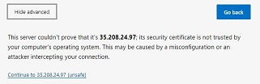

# Chef Lab:

## Agenda:
Chef is a configuration management tool to manage small and large scale infrastructure. The Lab exercise show the [requirements](https://docs.chef.io/chef_system_requirements), setup and working with Chef configuration 

To manage the infrastructure, Chef requires two Linux-based machines one for Chef-server and the other for Chef-Workstation. Small organizations can use the [Chef managed Server](https://manage.chef.io/) instead of setting up and managing Chef Server. 

The Lab setup discussed below, 
* Installation of Chef-Workstation and Chef-Client 
* Installation of Chef-Server and using [Chef managed Server](https://manage.chef.io/) 

#### **This part of Lab describes how to set up the Chef workstation and start creating workbooks and recipes**

### Step 1
### Installing workstation

Chef workstation is a Linux node in which all the configurations are created and tested, all successful configurations are pushed to Chef-Server.

####  Download  chef-workstation


Download the Chef-workstation package using the direct link below

```rb
#wget https://packages.chef.io/files/stable/chef-workstation/20.10.168/ubuntu/20.04/chef-workstation_20.10.168-1_amd64.deb
```

Alternatively, download link can be obtained from the download section of chef website  [here](https://downloads.chef.io/products/workstation)

 

Select the target OS and download the required version. However, the entire Lab discussed here is based on **Ubuntu-OS**. 


#### Install Chef workstation

```rb
# dpkg -i chef-workstation_20.10.168-1_amd64.deb
```

Once the chef is installed, verify the version with the below command, to ensure it is installed

```rb
#chef --version
```

### Step 2

#### Create Cookbooks and Recipes

Create cookbooks directory later we create  other cookbooks

```rb
# mkdir ~/cookbooks
# cd ~/cookbooks
```

In the cookbooks directory, generate a new cookbook - `new-cookbook`
	
 ```rb
# chef generate cookbook new-cookbook
 ```

This should generate a skeleton cookbook. The files are as follows

```rb
root@chef-wrokstation01:~/cookbooks# tree
.
└── new-cookbook
    ├── CHANGELOG.md
    ├── LICENSE
    ├── Policyfile.rb
    ├── README.md
    ├── chefignore
    ├── kitchen.yml
    ├── metadata.rb
    ├── recipes
    │   └── default.rb
    ├── spec
    │   ├── spec_helper.rb
    │   └── unit
    │       └── recipes
    │           └── default_spec.rb
    └── test
        └── integration
            └── default
                └── default_test.rb

8 directories, 11 files
root@chef-wrokstation01:~/cookbooks#
```

Create a recipe

Let us create a recipe. `chef generate recipe <recipe-name>` to create a new receipe.

change the directory to `new-cookbook`, and run `chef generate recipe new-recipe`

```rb
# cd new-cookbook
# chef generate recipe new-recipe
```

This will create `recipes/new-recipe.rb`, `spec/unit/recipes/new-recipe_spec.rb` , `test/integration/default/new-recipe_test.rb` files. 
In a recommended practice - every recipe should have spec defined in `spec/unit/recipes/new-recipe_spec.rb`and  relevant test cases in `test/default/new-recipe_test.rb`. However, for the purposes of this lab, our scope is limited to writing just recipes.

Now update `recipes/new-recipe.rb` with the following

```rb
root@chef-wrokstation01:~/cookbooks# cat new-cookbook/recipes/new-recipe.rb
file '/newfile' do            
content 'Chef new file'       
action :create                
end
root@chef-wrokstation01:~/cookbooks# 
```

Let's understand the contents of `new-receipe`

```rb
file '/newfile' do            # --> File name to be created and "do" means create 
content 'Chef new file'       # --> Content in the file, after creation of the file, chef will place the content 
action :create                # --> Create the file 
end                           # --> end of the task
```

#### Run the chef-client to execute the recipe

In order to run recipes, the recipe has to be free of any sytax errors. Syntax errors in recipes can be identified by running `chef exec ruby -c <recipe>`.

```rb
root@chef-wrokstation01:# cd ~/cookbooks
root@chef-wrokstation01:~/cookbooks# chef exec ruby -c new-cookbook/recipes/new-recipie.rb
Syntax OK
root@chef-wrokstation01:~/cookbooks#
```


Once the recipe is free of syntax errors, the recipe can be executed locally on the workstation machine using `chef-client`


```rb
root@chef-wrokstation01:# cd ~/cookbooks
root@chef-wrokstation01:~/cookbooks# chef-client -zr "recipe[new-cookbook::new-recipe]"
```

On the successful run it produces the output as 

```rb
Starting Chef Infra Client, version 16.6.14
Patents: https://www.chef.io/patents
resolving cookbooks for run list: ["new-cookbook::new-recipe"]
Synchronizing Cookbooks:
  - new-cookbook (0.1.0)
Installing Cookbook Gems:
Compiling Cookbooks...
Converging 1 resources
Recipe: new-cookbook::new-recipe
  * file[/newfile] action create
    - create new file /newfile
    - update content in file /newfile from none to d3b7c9
    --- /newfile   2020-1x-2x 19:45:x9.780289866 +0000
    +++ /.chef-falafal20201028-8246-ckf0aa 2020-10-28 19:45:59.780289866 +0000
    @@ -1 +1,2 @@
    +Chef new file
Running handlers:
Running handlers complete
Chef Infra Client finished, 1/1 resources updated in 01 seconds
```

Verify the new file `newfile` is created on the localhost

```rb
root@chef-wrokstation01:~# ls /newfile
/newfile
root@chef-wrokstation01:~# cat /newfile
Chef new fileroot@chef-wrokstation01:~#
```

#### Creating recipe with multiple tasks   

Often a recipe does more than a single/simple task. In order to acheive multiple tasks for example: installing multiple packages, changing multiple files etc.Below is an example to perform 5 tasks - 

a. create a file name `testfile` with sample content 
b. install package `tree` 
c. install package `apache` 
d. create a file `/var/www/html/index.html` with sample content
e. start linux service `apache2`


The recipe file is as follows and the code is explained in the later section. Copy this content into `new-recipe.rb` file created earlier


```rb

file 'testfile' do        
content 'Chef test file'  
action :create            
owner 'root'               
group 'root'
end

package 'tree' do   
action :install     
end 
 
package 'apache2' do    
action :install 
end 

file '/var/www/html/index.html' do  
content 'First delicious recipe please taste, the recipe and appreciate us' 
action :create   
end 

service 'apache2' do            
action [:enable, :start] 
end  

```

Details of the code for running multiple tasks is  

a. Creating `testfile`

```rb
file 'testfile' do        # --> specify the file
content 'Chef test file'  # --> content of the file
action :create            # --> action on the files
owner 'root'              # --> owner and group of the file 
group 'root'
end
```

b. Intalling 'tree' package

```rb
package 'tree' do   # --> package installation
action :install     # --> specifying the action
end 
```

c. Installing 'apache' package 

```rb
package 'apache2' do   # --> install httpd package 
action :install 
end 
```

d. Creating `/var/www/html/index.html` with sample content  

```
file '/var/www/html/index.html' do  # --> content in index.html 
content 'First delicious recipe please taste, the recipe and appreciate us'  # --> sample content
action :create   # --> create the file 
end 
```

e. Starting `apache2` service  


```
service 'apache2' do            # --> start the httpd service
action [:enable, :start] 
end  
```

After understanding the code above, run the recipe as show in steps below exactly similar to previous attempt.

```
root@chef-wrokstation01:~/cookbooks# chef exec ruby -c new-cookbook/recipes/new-recipe.rb 
root@chef-wrokstation01:~/cookbooks# chef-client -zr "recipe[new-cookbook::new-recipe]" 
```

**Validating recipe** 

Once the recipe is executed, validate if all the actions completely successfully.

Output of testfile

```rb
root@chef-wrokstation01:~# cat /testfile
Chef test fileroot@chef-wrokstation01:~#
```

Package "tree"

```rb
root@chef-wrokstation01:~# which tree
/usr/bin/tree
```

Package "apache"

```rb
root@chef-wrokstation01:~# systemctl status service_name
```

(Optional) Also open browser and run the IP address of the node. This step can sometimes fail due to firewall or other issues. Debugging this is outside scope of this excerise

```rb
root@chef-wrokstation01:~# curl localhost
First delicious recipe please taste, the recipe and appreciate usroot@chef-wrokstation01:~#
```

  


### Step 3 - Using hosted Chef Server to manage target  nodes


Now that we have some familiarity with cookbooks, receipes. Let's see how to use chef to manage target nodes. In this step, for simplicity and learning purposes managed chef server will be used. Managed chef-server is a chef-server installation that is managed by third party. In step 4 and later, Installation of chef-server is explained.

* Create an account in [manage.chef.io](https://manage.chef.io/login)
* Login into chef server
* Create an Organization
	*  Go to Administration from the top -> Organizations (left side) -> Create -> Full Name: <StudentFullName>, Short name: <StudentShortName>

* Download starter kit
	* Click on organization -> starter kit (left side)--> shows the download "starter kit" --> clicking on it downloads starterkit  

 

* Extract start kit, copy `chef-repo` folder to the chef-workstation. If you already downloaded on workstation then nothing to copy. `Winscp` or other equivalent tools can be used to copy files to workstation. 

  
 
 ```rb
 # cd chef-repo
 root@chef-wrokstation01:~/chef-repo#
 ```
 
Ensure you have copied all files

```rb 
root@chef-wrokstation01:~/chef-repo# tree
.
├── README.md
├── cookbooks
│   ├── chefignore
│   └── starter
│       ├── attributes
│       │   └── default.rb
│       ├── files
│       │   └── default
│       │       └── sample.txt
│       ├── metadata.rb
│       ├── recipes
│       │   └── default.rb
│       └── templates
│           └── default
│               └── sample.erb
└── roles
    └── starter.rb

9 directories, 8 files
root@chef-wrokstation01:~/chef-repo#
```

 
Run the below command to verify the workstation connectivity to the server. `knife` is already installed on workstation.

```rb
root@chef-wrokstation01:~/chef-repo# knife ssl check
Connecting to host api.chef.io:443
Successfully verified certificates from `api.chef.io'
root@chef-wrokstation01:~/chef-repo#
```

If the connection is successful, displays below message

```rb
Connecting to host api.chef.io:443
Successfully verified certificates from `api.chef.io`
```

The configuration file with details relating to connectivity to chef sever is present in `chef-repo/.chef/config.rb`

After connecting this workstation to the chef server, the next step is to add target nodes into chef server.

The process of connecting the node to the server is called *BOOTSTRAPPING*. The bootstrapping process will install `chef-client` (and other tools like ohai) and ensure connectivity to the server. `ohai` is the internal DB, which tells the chef-client about the status of the installations. Target nodes are managed by chef-server. 

The essentials of creating the nodes   
* If the nodes are in the cloud, make sure the ssh is working, the node private key file(.pem file) is copied to the workstation's "chef-repo" directory to enable secure connection (ssh/scp). Though workstation don't directly ssh into the node, copying the key into workstation enables ssh to the node  
* The required ports are opened properly (port 22 for ssh and other application ports like port 80 for web etc. on cloud nodes or Firewalls for physical nodes)  

Chef client uploads all the configurations from Chef workstation to the server, and the server in turn passes it to target nodes. **"Knife"** is a command line utility that is useful for these operations.

let us install the chef-client on the target node (node01) by following the steps below

```rb
root@chef-wrokstation01:~# cd chef-repo
```

Run the below command  

```rb
root@chef-wrokstation01:~/chef-repo# knife bootstrap <node-ip> --ssh-user <user-name>  --sudo -i <privatekey.pem> -N <node-name>
```

Example:  
```rb
root@chef-wrokstation01:~/chef-repo# knife bootstrap x5.2xx.2x.x7 --ssh-user root --sudo -i priv.pem -N chef-node01
```

Once the command is run, if all the components in the command are correct, the output will be as below  
It asks for Confirmation Yes/No `(Y/N)`, Type "Y" to continue  
```rb
Are you sure you want to continue connecting  --> asks for confirmation
? (Y/N) Y   								 # --> type Y
Connecting to xx.xx.xx.xx using ssh           --> connects to the node and installs chef client
Creating new client for node
Creating new node for node
Bootstrapping xx.xx.xx.xx
 [xx.xx.xx.xx] -----> Installing Chef Omnibus (stable/16)
downloading https://omnitruck.chef.io/chef/install.sh
  to file /tmp/install.sh.2426/install.sh
 [xx.xx.xx.xx] trying wget...
 [xx.xx.xx.xx] ubuntu 18.04 x86_64
 [xx.xx.xx.xx] Getting information for chef stable 16 for ubuntu...
 [xx.xx.xx.xx] downloading https://omnitruck.chef.io/stable/chef/metadata?v=16&p=ubuntu&pv=18.04&m=x86_64
  to file /tmp/install.sh.2430/metadata.txt
 [xx.xx.xx.xx] trying wget...
 [xx.xx.xx.xx] sha1    45ca38c5c110217fd36ffa7126c76e23c80fb001
sha256  3d260619c94108a0f5f25652fdea478e1f361e7ad40852420b94938bfe2e3184
url     https://packages.chef.io/files/stable/chef/16.6.14/ubuntu/18.04/chef_16.6.14-1_amd64.deb
version 16.6.14
 [xx.xx.xx.xx]
 [xx.xx.xx.xx] downloaded metadata file looks valid...
 [xx.xx.xx.xx] downloading https://packages.chef.io/files/stable/chef/16.6.14/ubuntu/18.04/chef_16.6.14-1_amd64.deb
  to file /tmp/install.sh.2430/chef_16.6.14-1_amd64.deb
 [xx.xx.xx.xx] trying wget...
 [xx.xx.xx.xx] Comparing checksum with sha256sum...
 [xx.xx.xx.xx] Installing chef 16
installing with dpkg...
 [xx.xx.xx.xx] Selecting previously unselected package chef.
 [xx.xx.xx.xx] (Reading database ... 50310 files and directories currently installed.)
 [xx.xx.xx.xx] Preparing to unpack .../chef_16.6.14-1_amd64.deb ...
 [xx.xx.xx.xx] Unpacking chef (16.6.14-1) ...
 [xx.xx.xx.xx] Setting up chef (16.6.14-1) ...
 [xx.xx.xx.xx] Thank you for installing Chef Infra Client! For help getting started visit https://learn.chef.io
 [xx.xx.xx.xx] Starting the first Chef Infra Client Client run...
 [xx.xx.xx.xx] +---------------------------------------------+
✔ 2 product licenses accepted.
+---------------------------------------------+
 [xx.xx.xx.xx] Starting Chef Infra Client, version 16.6.14
Patents: https://www.chef.io/patents
 [xx.xx.xx.xx] [2020-11-02T10:17:52+00:00] ERROR: shard_seed: Failed to get dmi property serial_number: is dmidecode installed?
 [xx.xx.xx.xx] resolving cookbooks for run list: []
 [xx.xx.xx.xx] Synchronizing Cookbooks:
 [xx.xx.xx.xx] Installing Cookbook Gems:
 [xx.xx.xx.xx] Compiling Cookbooks...
 [xx.xx.xx.xx] [2020-11-02T10:17:52+00:00] WARN: Node node has an empty run list.
 [xx.xx.xx.xx] Converging 0 resources
 [xx.xx.xx.xx]
Running handlers:
 [xx.xx.xx.xx] Running handlers complete
 [xx.xx.xx.xx] Chef Infra Client finished, 0/0 resources updated in 02 seconds
 ```
 Once the chef-client is successfully installed on the client node, run the below command on chef-workstation 
 
 The lists the nodes which have the chef-client installed  
 
 ```rb
 root@chef-wrokstation01:~/chef-repo# knife node list
 ```
 
 The output will be 
 
 ```rb
 root@chef-wrokstation01:~/chef-repo# knife node list
chef-node01
root@chef-wrokstation01:~/chef-repo#
```

Now let us upload cookbooks into chef-server. Follow the simple commands below to achieve this
```rb
root@chef-wrokstation01:~# mv ~cookbooks ~chef-repo/cookbooks
root@chef-wrokstation01:~# rm -rf ~cookbooks
root@chef-wrokstation01:~# cd chef-repo
root@chef-wrokstation01:~/chef-repo# knife cookbook upload new-cookbook01
Uploading new-cookbook [0.1.0]
Uploaded 1 cookbook.

```

The following command helps in uploading cookbooks to the server from workstation. These cookbooks are downloaded by target nodes. 

```
root@chef-wrokstation01:~/chef-repo# knife cookbook upload <cookbookname>
```

** Validate: **

On the Chef-server website, click on policy the uploaded cookbook is visible  

  

##### Next step is run the uploaded recipe of the cookbook on the target node, with the below command  

```rb
root@chef-wrokstation01:~/chef-repo# knife node run_list set <chef-node> "recipe[cookbook-name::recipe-name]"
```

Example:  

```rb
root@chef-wrokstation01:~/chef-repo# knife node run_list set chef-node01 "recipe[new-cookbook01::new-recipe]"
chef-node01:
  run_list: recipe[new-cookbook01::new-recipe]
```

The above command associates the **cookbook** and the **recipe** that are previously uploaded to a `Chef-client` node (chef-node01)

To verify the recipe in runlist, run the below command  

```rb
root@chef-wrokstation01:~/chef-repo# knife node show <node-name>
```

Example:  

```rb
root@chef-wrokstation01:~/chef-repo# knife node show chef-node01
```

The output of the command will be like below  
```rb
# chef-node01:
  run_list: recipe[new-cookbook01::new-recipe]
root@chef-wrokstation01:~/chef-repo/cookbooks/new-cookbook01/recipes# knife node show chef-node01
Node Name:   chef-node01
Environment: _default
FQDN:        chef-node01.us-central1-a.c.august-broker-272610.internal
IP:          35.208.24.97
Run List:    recipe[new-cookbook01::new-recipe]
Roles:
Recipes:
Platform:    ubuntu 18.04
Tags:
```

**The above output on the node shows the <ins>run_list</ins> is uploaded** 

Alternatively, you can also check on chef-server web page, select the node and click on edit-runlist, which displays the runlists  
   

The exact steps described above are followed after udpates to the recipe or cookbooks, run the below command on chef-workstation  

```rb
 root@chef-wrokstation01:~/chef-repo# knife cookbook upload <cookbook-name>
 ```
 example:  
 ```
 root@chef-wrokstation01:~/chef-repo# knife cookbook upload new-cookbook
 ```
 
 This uploads the recipe to the server, then run the below command again on the target node to update the recipe on client  
 
 ```rb
  root@chef-wrokstation01:~/chef-repo# chef-client
 ```
 
 Once the chef-client is run, the output will be as below  
 
 ```rb
 root@chef-wrokstation01:~/chef-repo# chef-client
Starting Chef Infra Client, version 16.6.14
Patents: https://www.chef.io/patents
[2020-11-02T13:02:14+00:00] ERROR: shard_seed: Failed to get dmi property serial_number: is dmidecode installed?
resolving cookbooks for run list: ["new-cookbook01::new-recipe"]
Synchronizing Cookbooks:
  - new-cookbook01 (0.1.0)
Installing Cookbook Gems:
Compiling Cookbooks...
Converging 1 resources
Recipe: new-cookbook01::new-recipe
  * file[/newfile] action create
    - create new file /newfile
    - update content in file /newfile from none to b1db38
    --- /newfile        2020-11-02 13:02:15.732149257 +0000
    +++ /.chef-newfile20201102-5329-iahaqg      2020-11-02 13:02:15.728148985 +0000
    @@ -1 +1,2 @@
    +Welcome to chef delecies

Running handlers:
Running handlers complete
Chef Infra Client finished, 1/1 resources updated in 02 seconds
```

If the file is up to date, the output will be  
```rb
Recipe: new-cookbook01::new-recipe
  * file[/newfile] action create (up to date)
```

### Step 4

In step3, we have used a managed chef-server hosted by third-party. In this section, we will look at installation of chef-server.

*The steps to follow to install the Chef-Server on Ubuntu is as below*  

**Download the [Chef-Server](https://downloads.chef.io/products/infra-server?os=ubuntu)**  

##### Download the Chef-Server Package with Wget 

```rb
 #wget https://packages.chef.io/files/stable/chef-server/14.0.65/ubuntu/20.04/chef-server-core_14.0.65-1_amd64.deb
```

##### Install the package  

```rb
#  dpkg -i chef-server-core_14.0.65-1_amd64.deb
```

Once the installation is done, run the following command, which reconfigures all the installation  

```
# chef-manage-ctl reconfigure
```

This will take 5 to 10 minutes to configure the server and show the running messages of the configuration like  

```rb
+set $add_on_override_upstream "chef_manage_webapp";
    - change mode from '' to '0644'
    - change owner from '' to 'root'
    - change group from '' to 'root'
  * file[/var/opt/opscode/nginx/etc/addon.d/30-opscode-manage_external.conf] action delete (up to date)
  * template[/var/opt/opscode/nginx/etc/nginx.d/manage.conf] action delete (up to date)
Recipe: omnibus-chef-manage::default
  * link[/usr/bin/chef-manage-ctl] action create (up to date)
  * link[/usr/bin/opscode-manage-ctl] action create (up to date)
  * file[/var/opt/chef-manage/etc/chef-manage-running.json] action create
    - create new file /var/opt/chef-manage/etc/chef-manage-running.json
    - update content in file /var/opt/chef-manage/etc/chef-manage-running.json from none to 5199d2
    --- /var/opt/chef-manage/etc/chef-manage-running.json       2020-11-05 09:32:15.869262054 +0000
    +++ /var/opt/chef-manage/etc/.chef-chef-manage-running20201105-87766-yoa1h.json     2020-11-05 09:32:15.869262054 +0000
```
  
After successful configuration, the output will be like  

```rb
Running handlers:
Running handlers complete
Chef Client finished, 9/136 resources updated in 14 seconds
chef-manage Reconfigured!
```

* Create admin user with below command 

```rb
# chef-server-ctl user-create admin admin administrator admin01@gmail.com 'abc123' --filename  /serv.pem
```
`serv.pem`:  An RSA private key is generated automatically. This is the user’s private key and should be saved to a safe location, `/serv.pem` is in file location  
* Create  organization

```rb
# chef-server-ctl org-create 4thcoffee 'A E Inc.' --association_user admin --filename /ae-validator.pem
```

In the above example, the org is  '4thcoffee 'A E Inc.',  associated name is 'admin' and validator key is 'ae-validator.pem'  

Once the Org is created, run the reconfiguration command to enable the user and Org  

```rb
# chef-manage-ctl reconfigure
```

Install Web Manage Interface for the chef Server the command is below  

```rb
 # chef-server-ctl install chef-manage
```

Run the below command to reconfigure the Web Manage, slightly different from the above reconfigure  

```rb
# chef-manage-ctl reconfigure
```

With the FQDN or the IP address of the server in the browser  
First a security message appears as below  
  

Click on advanced and continue    

  

It opens login web page to manage Chef server  

Take the username and password, created during the admin user, in this case  
user: admin  
password: abc123 (strong password is always recommended)  

Once logged in follow the steps in <ins>[Step 3](#step-3---using-hosted-chef-server-to-manage-target--nodes)</ins> from above description  

###  Step 5 

Chef-Roles:  
A [Chef-Role](https://docs.chef.io/roles/) is a way to define certain patterns and processes that exist across nodes in an organization as belonging to a single job function.

*Before getting into roles, it is required to understand the [run_list](https://docs.chef.io/run_lists/), described in Step 3 and Step 4 

Roles is logical way to group cookbooks and recipes together.

On Chef-Workstation run the below commands  

```rb
# cd chef-repo
```
Under chef-repo, roles directory is listed  

```rb
root@chef-wrokstation01:~/chef-repo# ls
README.md  cookbooks nodes  roles  
```
Tree output  
```rb
├── nodes
│   └── student01.json
└── roles
    └── starter.rb
```
Create a new role file (default.rb is a default role) with the editor  

```rb
# cd roles
~/chef-repo/roles#  vi newrole.rb
```
Add the below contents in the newrole  

```rb
name "newrole"  
description "role upload file"  
runlist "recipe[new-cookbook01::new-recipe]"
```
Once the role is created, need to update the role with the below command   

```rb
root@chef-wrokstation01:~/chef-repo# knife role from file roles/newrole.rb
Updated Role newrole
```

Once the role is updated to the Chef-Server, login to chef-server, under Policy --> Roles(left side column)  
The newly created role is visible  
  

**All the nodes which chef-client needs to be installed, should be bootstrapped for the first time**  

Connect the roles to the nodes, with below command  	
```rb
# knife node run_list set chef-node01 "role[newrole]" 
```
The output will be like  
```rb
chef-node01:
  run_list: role[newrole]
```
This is visible in  chef-server nodes --> editRunList --> Available Roles (rolename is visible)  
  

NOTE: This lab has covered just the basics of role. You can read more advanced use cases of roles [here](https://docs.chef.io/roles/) 
